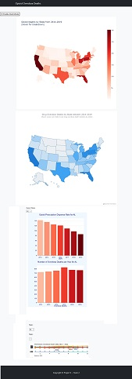
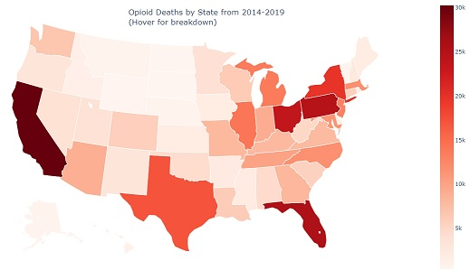
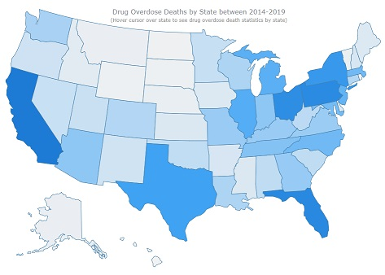

 
<h1>Project 3: Opioid Drug Overdose Deaths</h1>

<h2>Project Description</h2>

<h4>This project analyzes opioid overdose data from the United States for all states for the year range including 2013 and 2019.
The data used was primarily contained within a CSV file found on the CDC website called "Opioid Overdose Deaths” (2014-2019.
<ul>
<li>https://www.health.state.mn.us/communities/opioids/opioid-dashboard/index.html</li>. 
</ul>
"U.S. State Opioid Dispensing Rate 2013-2019 data was scraped from the CDC webpage:
<ul>
<li>https://www.cdc.gov/drugoverdose/rxrate-maps/index.html</li>
</ul>
"Provisional Drug Overdose Death Counts 2015-2022" data was also scraped from the CDC webpage:
<ul>
<li>https://www.cdc.gov/nchs/nvss/vsrr/drug-overdose-data.htm</li>
</ul>
 
</h4>

<h2>Bootstrap Website ~ (Brandon) 
https://basse058.github.io/Project-3-Overdose/templates/index.html</h2>

<ul>
  <li>Created header and footer.</li>
  <li>Created boxed layout.</li>
  <li>Added maps and charts via iframe embeds.</li>
  <li>Added JS script and CSS to add light and dark mode toggle.</li>
</ul>

<h2>Choropleth Maps</h2>
<h3>Plotly Choropleth Map ~ (Brandon) 
https://basse058.github.io/Project-3-Overdose/plotly-map</h3>

<h3>Extract</h3>
<ul>
  <li>Data scraped into excel and converted to <a href="https://github.com/basse058/Project-3-Overdose/blob/main/Resources/OpioidDeathsAll.csv">OpioidDeathsAll.csv</a> by Chris G.</li>
</ul>
<h3>Transform</h3>
<ul>
  <li>Data cleaned by renaming columns as appropriate.</li>
  <li><a href="https://github.com/basse058/Project-3-Overdose/blob/main/Resources/OpioidDeathsAll.csv">OpioidDeathsAll.csv</a> data cleaned/formatted into <a href="https://github.com/basse058/Project-3-Overdose/blob/main/Resources/OpioidDeathsAll-cleaned-3.csv">OpioidDeathsAll-cleaned-3.csv</a> file.</li>
</ul>
<h3>Load</h3>
<ul>
  <li>OpioidsDeathAll-cleaned-3 imported via pandas into plotly-map.py</li>
  <li><a href="https://github.com/basse058/Project-3-Overdose/blob/main/plotly-map.py">plotly-map.py</a> coded with df to include specific data from OpioidsDeathAll-cleaned-3</li>
  <li>Used <a href="https://github.com/basse058/Project-3-Overdose/blob/main/plotly-map.py">plotly-map.py</a> to read data, create dataframe, build map and output <a href="https://github.com/basse058/Project-3-Overdose/blob/main/plotly-map.html">plotly-map.html</a> file.</li>
</ul>
 
<h3>AnyChart Choropleth Map ~ (Brandon) 
https://basse058.github.io/Project-3-Overdose/anychart.html</h3>

<h3>Extract</h3>
<ul>
  <li>Data copied from previous map into <a href="https://github.com/basse058/Project-3-Overdose/blob/main/AnyChartMap/data.json">data.json</a> file for AnyChart Choropleth Map</li>
</ul>
<h3>Transform</h3>
<ul>
  <li>Data was already clean from previous map.</li>
  </ul>
<h3>Load</h3>
<ul>
  <li>Javascript pulled from CDN into <a href="https://github.com/basse058/Project-3-Overdose/blob/main/AnyChartMap/anychart.html">anychart.html</a></li>
  <li>Data read from <a href="https://github.com/basse058/Project-3-Overdose/blob/main/AnyChartMap/data.json">data.json</a></li>
</ul>
 
<h2>Bar Charts</h2>
<h3>Bar Chart 1 & 2 ~ (Chris) 
https://github.com/basse058/Project-3-Overdose/BarCharts/barchart_index.html</h3>

<h3>Extract</h3>
<ul>
  <li>fgldakfjhgv</li>
</ul>
<h3>Transform</h3>
<ul>
  <li>sdfvbk dsfvb</li>
  <li>dfsvbjsdflhjbk</li>
</ul>
<h3>Load</h3>
<ul>
  <lifsgbsfdglojkb</li>
  <li>fgb;flskjgb</li>
  <li>sfkg;jbnsfdjk;gb</li>
</ul>
 
<h2>Render</h2>
<h3>SQLite Database & OnRender Website 
https://project-3-h7kg.onrender.com/</h3>
(insert image here)
<h3>Title</h3>
<ul>
<li>Provisional overdose death data sourced from CDC <a href="https://www.cdc.gov/nchs/nvss/vsrr/prov-county-drug-overdose.htm">CDC web page</a> </li>
<li>dataset was loaded in SQLite database. Using the app.py file in root folder, the proper data is pulled for the line graph showing the monthly overdose counts for up to 12 months for the state selected by the dropdown like the bar charts. </li>
<li>Render is used to host the site and SQLite database.</li>
</ul>
 
<h2>Presentation</h2>
<h3>Slideshow ~ (Madina) 
https://docs.google.com/presentation/d/1yLrDGqCc9DOo0mkTwuMQH3fmSIiOUHch/</h3>

<h3>Title</h3>
<ul>
<li>List1</li>
<li>List2</li>
<li>List3</li>
</ul>
 
<h3>Elements</h3>
<ul>
<li>Render Webpage: https://project-3-h7kg.onrender.com/</li>
<li>Bootstrap Website ~ https://basse058.github.io/Project-3-Overdose/templates/index.html</li>
<li>Plotly Map - https://basse058.github.io/Project-3-Overdose/plotly-map</li>
<li>AnyChart Map ~ https://basse058.github.io/Project-3-Overdose/AnyChartMap/anychart.html</li>
<li>Bar Charts ~ https://basse058.github.io/Project-3-Overdose/BarCharts/barchart_index.html</li>
 </ul>
 
<h3>Data</h3>
<ul>
<li>https://www.cdc.gov/drugoverdose/rxrate-maps/index.html</li>
<li>https://www.cdc.gov/nchs/nvss/vsrr/drug-overdose-data.htm</li>
<li>https://www.health.state.mn.us/communities/opioids/opioid-dashboard/index.html</li>
</ul>
